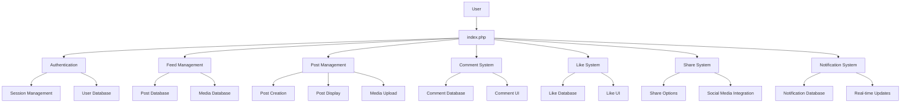
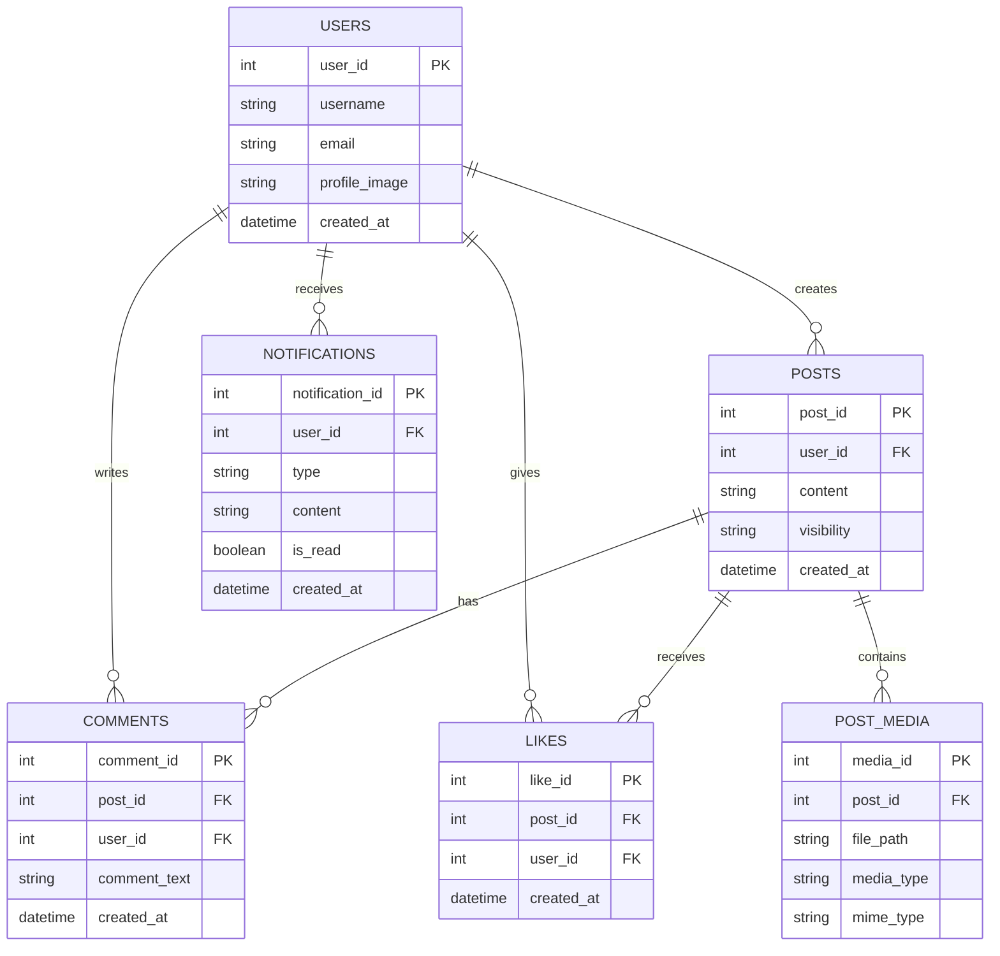
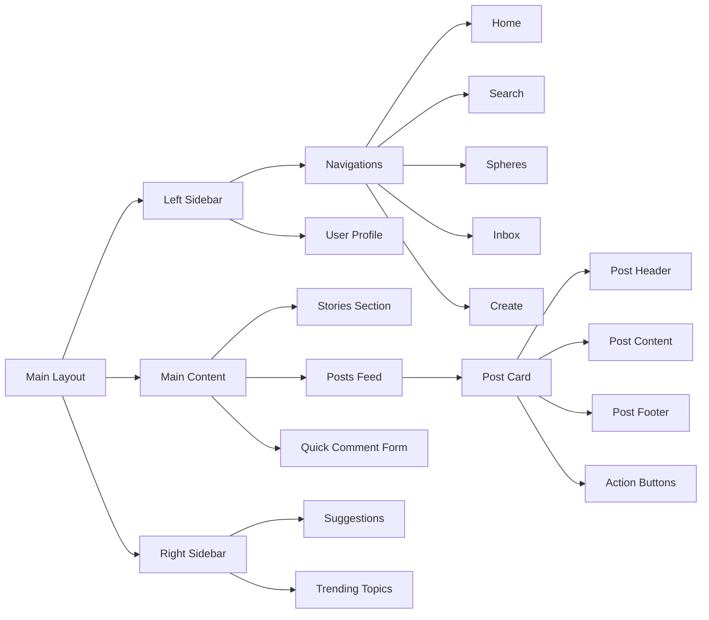
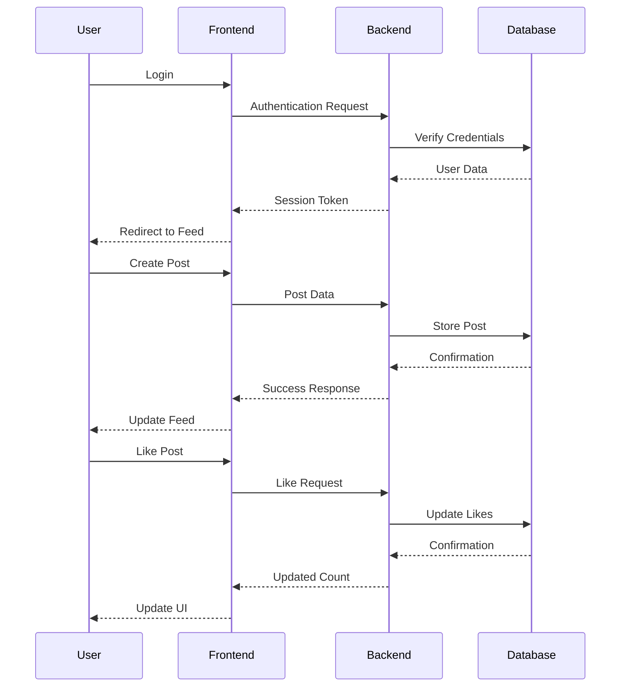
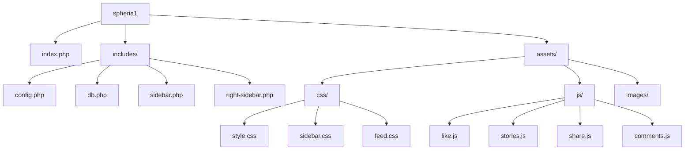

# Spheria Platform Architecture

## System Overview

## Database Schema

## Frontend Components

## User Interactions

## File Structure

graph LR
    A[Main Layout] --> B[Left Sidebar]
    A --> C[Main Content]
    A --> D[Right Sidebar]
    
    C --> E[Stories Section]
    C --> F[Posts Feed]
    C --> G[Quick Comment Form]
    
    B --> H[Navigations]
    H --> Home
    H --> Search
    H --> Spheres
    H --> Inbox
    H --> Create
    B --> I[User Profile]
    
    D --> J[Suggestions]
    D --> K[Trending Topics]
    
    F --> L[Post Card]
    L --> M[Post Header]
    L --> N[Post Content]
    L --> O[Post Footer]
    L --> P[Action Buttons]