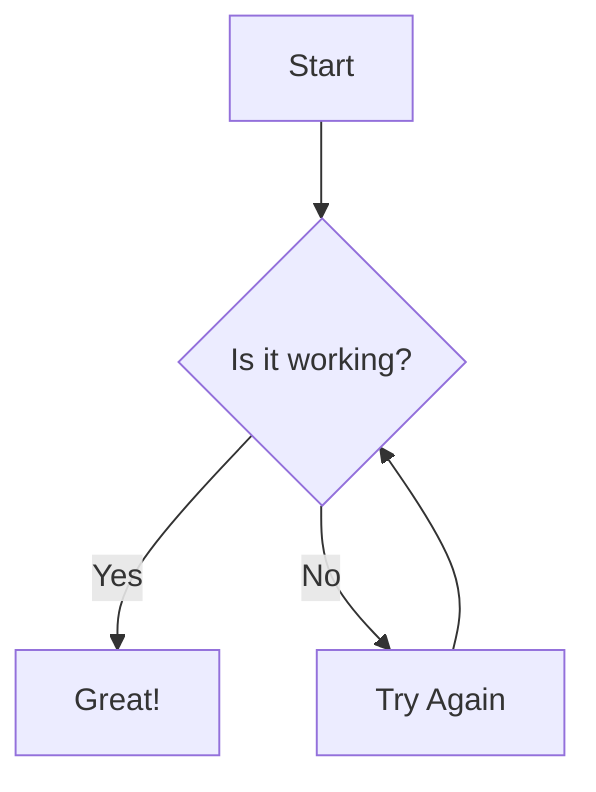
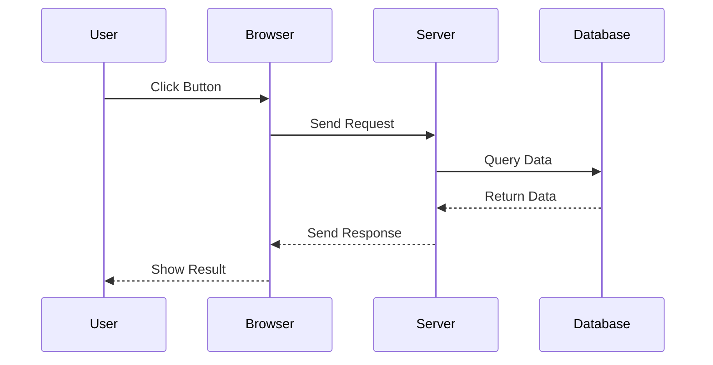
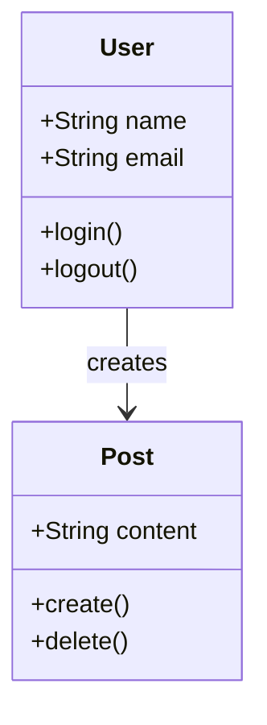

# Mermaid Examples

## Simple Flowchart


## Simple Sequence Diagram


## Simple Class Diagram



```mermaid
flowchart TD
    A[Web Page] -- Input Data --> B[Server (PHP)]
    B -- Gorgias Query --> C[Cloud Gorgias API]
    C -- Gorgias Query --> D[Cloud Gorgias]
    D -- Results/Explanation --> C
    C -- Results/Explanation --> B
    B -- Results & Explanation --> A

    subgraph Server
        B
        C
    end

    D[Cloud Gorgias]
``` 

flowchart TD
    User --> Login
    User --> Register
    Login -->  Web[Home Page]
    Register --> verify[Account verification]
    verify --> Web[Home Page]
    Server[PHP Serve]
    DB[(Database Encrypted Tables)]

    Web -- Send Input Data --> Server
    Server -- Query / Store Data<br/>(Encrypt/Decrypt) --> DB
    DB -- Return Data --> Server
    Server -- Send Results --> Web